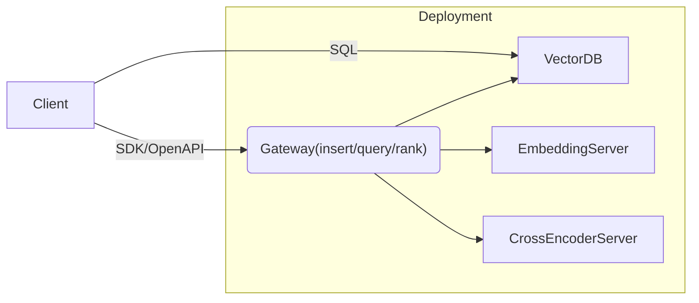

# End-to-end Interface

## Deployment

1. Vector DB
2. Gateway?
3. (optional) Embedding Server
4. (optional) Cross-Encoder Server

TBD: should the reranker be part of the gateway or SDK?

## Insert

1. through the SDK/OpenAPI
    - `POST /api/doc` with `text`, `title`, `tags`, etc.
    - `.insert(text, title, tags, etc.)`
    - generate the vector if not provided

2. through the DB
    - `INSERT INTO docs (text, title, vector, etc.) VALUES (...)`
    - requires the vector

## Query

1. through the SDK/OpenAPI
    - `GET /api/query` with `query`, `metadata`, etc.
    - `.query(query, metadata)`

2. through the DB
    - `SELECT * FROM docs WHERE ...`

## Rank

- convert to `Record`
- various ranking methods
